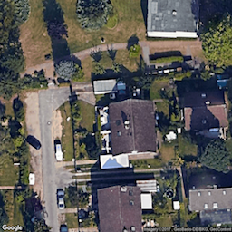
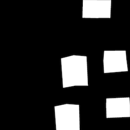
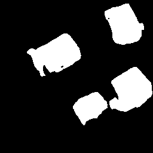
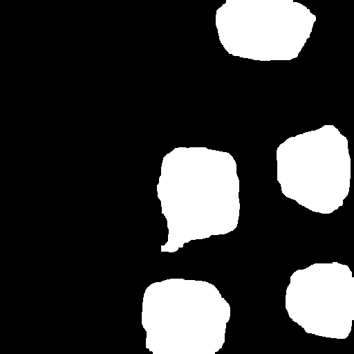
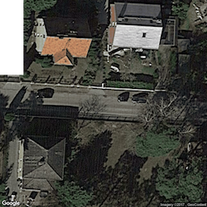
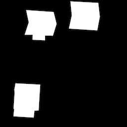
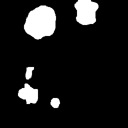

# MATH 604: Satellite Imagery Building Segmentation
This repository contains the final project for the **Theory of Deep Learning** course.

## 🏗️ Model Performance Analysis
The model successfully identifies building footprints using a custom U-Net architecture. Below is a comparison between the original satellite image, the ground truth label, and our model's prediction.

| Satellite Image | Ground Truth (Label) | Model Prediction (0.8 Threshold) |
| :---: | :---: | :---: |
|  |  |  |

## 📊 Model Inference Results
Below is a side-by-side comparison of the Original Image, Ground Truth Label, and our U-Net Prediction.

| Satellite Image | Ground Truth (Label) | U-Net Prediction (0.8 Threshold) |
| :---: | :---: | :---: |
|  |  |  |
|  |  |  |

## 🚀 Key Improvements
- **Batch Normalization:** Added to every convolution block to stabilize training.
- **Weighted Loss:** Implemented BCEWithLogitsLoss with a positive weight to prioritize building pixels.
- **MPS Optimization:** Configured for high-performance training on Apple Silicon.

## 🛠️ Tech Stack
- **Framework:** PyTorch
- **Augmentation:** Albumentations
- **Optimizer:** Adam with OneCycleLR Scheduler