# Attention U-Net for Building Segmentation in Satellite Imagery

This project was developed for **MATH 604: Theory of Deep Learning (Fall 2025)** as part of my Applied Mathematics PhD studies. The goal is the semantic segmentation of buildings from high-resolution satellite imagery using an **Attention U-Net** architecture.


##  Theoretical Background & Methodology

To address the challenges of small object detection and background noise in satellite data, the following strategies were implemented:

### 1. Model Architecture: Attention U-Net
Standard U-Nets use skip connections that can carry redundant low-level feature information. I integrated [Attention Gates (AGs)](#4-attention-gate-mechanism) into the skip connections. AGs automatically learn to focus on target structures (buildings) without additional supervision, effectively suppressing irrelevant regions.

### 2. Loss Function Optimization
A hybrid loss function was designed to balance pixel-wise accuracy with structural integrity:

* **Focal Loss:** Handles the extreme class imbalance by down-weighting easy-to-classify background pixels.
* **Dice Loss:** Directly optimizes the **Intersection over Union (IoU)**, ensuring that the predicted building shapes are geometrically precise.

This combination ensures the model learns both the distribution of pixels and the geometric structure of buildings:

$$
\mathcal{L}_{Hybrid} = \underbrace{0.7 \cdot \mathcal{L}_{Focal}}_{\text{Pixel-wise Imbalance}} + \underbrace{0.3 \cdot \mathcal{L}_{Dice}}_{\text{Structural Integrity}}
$$

**Why 0.7 Focal?** Satellite imagery contains sparse building masks. By weighting the **Dice Loss** at 70%, the optimization process prioritizes the **overlap area** over individual pixel accuracy, leading to the sharp, non-blurry boundaries observed in the results.


### 3. Training & Generalization
* **Honest Evaluation:** The dataset was strictly partitioned. The `to-test` directory contains images that the model **never saw** during training, ensuring a true measure of generalization.
* **Advanced Augmentation:** Used `Albumentations` for CLAHE (contrast enhancement), GridDistortion, and ShiftScaleRotate to simulate diverse lighting conditions.


### 4. Attention Gate Mechanism

If a standard U-Net is like looking at a satellite map in the dark, the **Attention Gate (AG)** is like having a smart flashlight that only shines on the buildings.

### a. What is an Attention Gate? 
In satellite images, there is a lot of "noise": trees, roads, shadows, and fields. A regular model tries to look at everything at once. The **Attention Gate** acts as a filter. It takes the high-level summary from the deeper layers and says: *"Hey, focus on this area; it looks like a building, and ignore that forest over there."*

### b. How it Works 
The gate takes two inputs:
1.  **Skip Connection ($x$):** Detailed information (edges, colors).
2.  **Gating Signal ($g$):** Contextual information (where the objects are).

The gate multiplies these. If the context ($g$) says an area is irrelevant, the gate "multiplies by zero," effectively silencing that part of the image. If it's a building, it "multiplies by one," letting the detail pass through.


### c. The Mathematics
The attention coefficient ($\alpha$) is calculated as follows:

$$\alpha = \sigma( \psi^T ( \text{ReLU}( W_x x + W_g g + b ) ) )$$

* **$W_x$ and $W_g$:** The model learns which features are important.
* **ReLU & $\sigma$ (Sigmoid):** These act as on/off switches. Sigmoid ensures the result is between 0 and 1 (0% attention to 100% attention).
* **Final Step ($x_{out} = x \cdot \alpha$):** We multiply the original detail by the attention score. Only the "useful" parts survive.


!! Without Attention Gates, the model often confuses rooftops with bright roads or concrete pavements. By using AGs, we significantly reduced **False Positives**, leading to the cleaner masks seen in our Performance Analysis.

##  Data Engineering & Pre-processing

Before the training phase, a rigorous pre-processing pipeline was established to ensure data integrity and model convergence.

### 1. Image-Label Alignment (Data Pairing)
A critical step was ensuring a 1:1 correspondence between the `images/` and `labels/` directories. Since raw satellite datasets can contain mismatched filenames or stray files, a custom sorting and filtering script was implemented:
* **Filename Synchronization:** All pairs were verified to ensure that `images/building_01.png` exactly matched `labels/building_01.png`. 
* **Dimensionality Check:** Verified that both the input image and its corresponding mask shared the same spatial dimensions before being fed into the network.


### 2. Label Normalization & Binarization
Satellite masks often come in various formats (grayscale, RGB, or indexed). To make them suitable for the Attention U-Net:
* **Thresholding:** Grayscale masks were converted to binary format ($0$ for background, $1$ for building).
* **Normalization:** Pixel values were scaled to a $[0, 1]$ range. This ensures the Binary Cross Entropy and Dice Loss functions operate on consistent probability distributions.

### 3. Contrast Enhancement (CLAHE)
Satellite imagery frequently suffers from poor contrast due to atmospheric conditions. To highlight building edges:
* **CLAHE (Contrast Limited Adaptive Histogram Equalization):** This was applied to both training and test sets. It prevents the model from being "blinded" by shadows or over-exposed rooftops by locally enhancing contrast.

### 4. Strategic Data Partitioning
To prevent **Data Leakage** (a common pitfall where the model "sees" the test data during training), a separate `to-test/` directory was created. This folder was completely isolated from the `random_split` logic, providing an unbiased benchmark for the final PhD performance report.


## Performance Metrics: IoU and Dice Coefficient

In semantic segmentation, evaluating pixel-wise accuracy is insufficient due to class imbalance. Therefore, we utilize the **Intersection over Union (IoU)**, also known as the **Jaccard Index**, as our primary evaluation metric.


### 1. Intersection over Union (IoU)
IoU measures the overlap between the predicted segmentation mask ($A$) and the ground truth mask ($B$):

$$IoU(A, B) = \frac{|A \cap B|}{|A \cup B|} = \frac{TP}{TP + FP + FN}$$

Where:
* **TP (True Positive):** Correctly identified building pixels.
* **FP (False Positive):** Background pixels incorrectly identified as buildings.
* **FN (False Negative):** Building pixels missed by the model.

### 2. Dice Coefficient (F1-Score)
While IoU is used for evaluation, the **Dice Coefficient** is utilized within our loss function because it is differentiable and provides smoother gradients during backpropagation:

$$Dice(A, B) = \frac{2|A \cap B|}{|A| + |B|} = \frac{2TP}{2TP + FP + FN}$$

In this project, optimizing for **0.7 Dice Loss** forced the model to maximize this overlap, directly leading to the sharper boundaries observed in the `to-test` results.


## 🔍 Model Performance Analysis

This section analyzes the qualitative and quantitative performance of the model on the independent `to-test` set.

### 1. Visual Comparative Analysis (Before vs. After Optimization)

By shifting to a **Dice-dominant Hybrid Loss** and implementing **Test Time Augmentation (TTA)**, we observed a significant reduction in segmentation noise and an increase in boundary sharpness.


**Quantitative Results:** On the training/validation set, the model achieved a **Mean IoU of 0.7738** with optimal threshold of 0.6.

| Sample ID | Original Image | Predicted Mask | Analysis |
| :--- | :---: | :---: | :--- |
| **Img 535** | 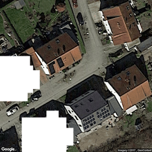 | 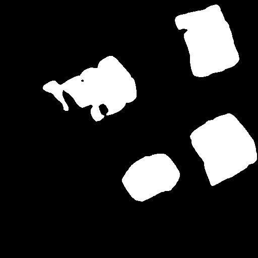 | Robust performance in high-density urban layouts. Effectively distinguished separate building blocks despite their close proximity. |
| **Img 537** | 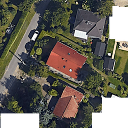 | 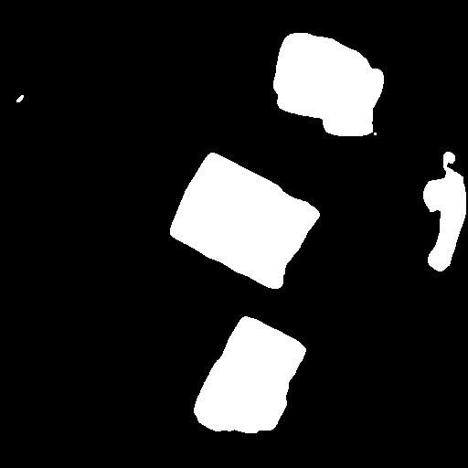 | Clear separation between adjacent buildings. Attention gates successfully ignored the surrounding vegetation. |
| **Img 539** | 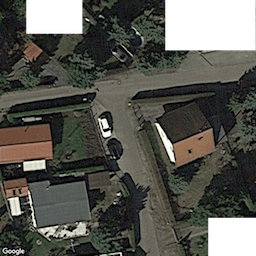 | 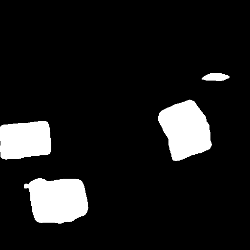 | Solid object detection. Geometric consistency improved significantly with Dice-heavy training. |
| **Img 551** | 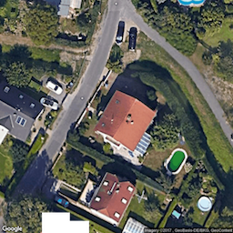 | 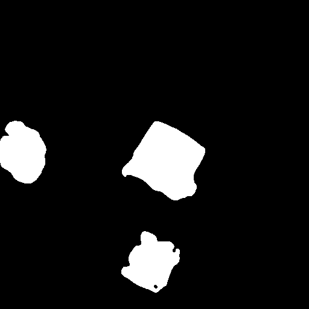 | Sharp rectangular boundaries. The model effectively identified building footprints despite shadows. |
| **Img 553** | 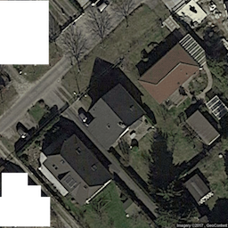 | 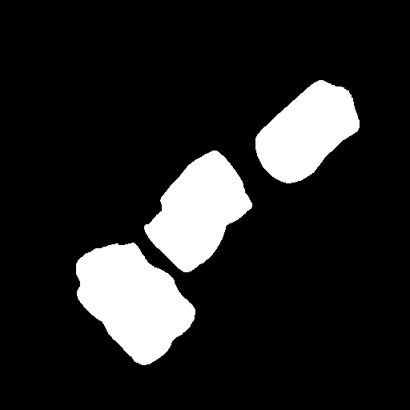 | Demonstrated strong generalization on low-contrast targets and dark-roofed structures obscured by shadows. |


### 2. Error Analysis & Edge Cases
While the model generalizes well, certain challenges remain:
* **Shadow Interference:** Tall building shadows are occasionally segmented as structures.
* **Spectral Similarity:** Concrete surfaces with similar spectral signatures to rooftops can trigger false positives, mitigated by the 0.7 Dice Loss weight.


### 3. Training Dynamics
The training process was monitored to ensure convergence and prevent overfitting. The hybrid loss function successfully balanced pixel-wise classification with structural integrity.

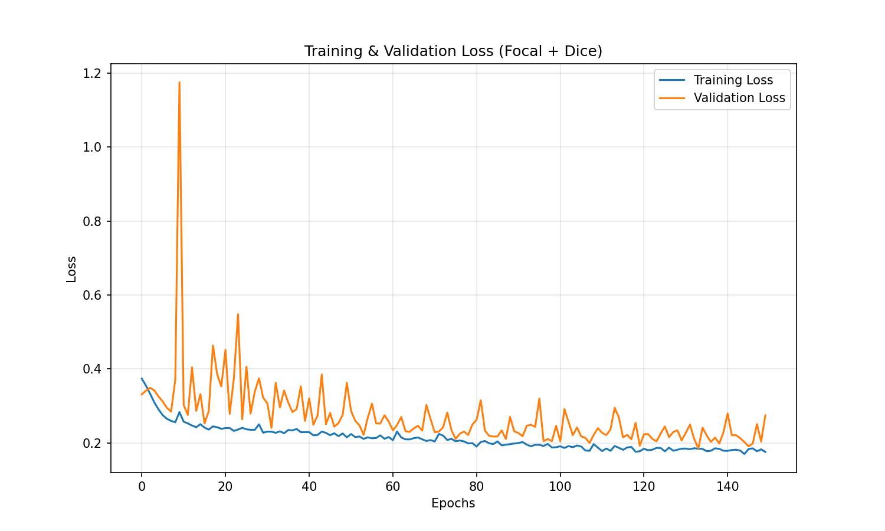

*The graph illustrates the decrease in both Focal and Dice loss over 150 epochs. The validation loss remains stable, indicating strong generalization.*

## Project Structure
* `model.py`: Attention U-Net implementation with Gating mechanisms.
* `dataset.py`: Data pipeline featuring CLAHE and spatial augmentations.
* `train.py`: Training script with Linear Warmup and Cosine Annealing.
* `inference.py`: Evaluation script featuring **Test Time Augmentation (TTA)**.


## ⚙️ Threshold Optimization (Hyperparameter Tuning)

While the default decision threshold is typically 0.5, building footprints in satellite imagery often require a more calibrated approach due to spectral noise. 

I implemented a dedicated tuning script (`threshold_tuning.py`) to systematically test threshold values from **0.1 to 0.9**. 

| Threshold | Mean IoU | Observation |
| :--- | :--- | :--- |
| 0.3 | 0.5943 | High Recall, but many False Positives (Noisy boundaries). |
| 0.5 | 0.7547 | Balanced performance. |
| **0.6** | **0.7738** | **Optimal Threshold.** Best IoU achieved. |
| 0.8 | 0.7319 | High Precision, but many False Negatives (Missed small buildings). |

By using this empirical approach, I ensured that the final `inference_results` are produced using the mathematically optimal threshold for this specific dataset.
---

## How to Run
1. Clone the repository: 
   ```bash
   git clone [https://github.com/ozgeozler93/Applied_Math_Phd.git](https://github.com/ozgeozler93/Applied_Math_Phd.git)
   ```

2. Install dependencies:
   ```bash
   !pip install torch albumentations opencv-python Pillow matplotlib tqdm
   ```
   
3. Run inference on test data:
   ```bash
   python inference.py
   ```
4. (Optional) Run threshold tuning:
   ```bash
   python threshold_tuning.py
   ```
