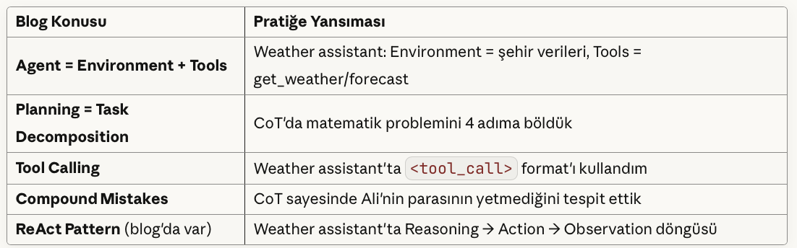

# GSÜ LLM Ödev 1 - Prompting Teknikleri Raporu

**Öğrenci Ismi Soyismi:** Makbule Özge Özler

**Tarih:** 11 Ekim 2025

---

## ÖZET

Bu ödevde 4 farklı prompting tekniğini (Zero-Shot, Few-Shot, Chain-of-Thought, Tool Calling) pratikte deneyerek LLM'lerin nasıl yönlendirilebileceğini öğrendim. Aynı görevi farklı tekniklerle çözdüğümde hız, detay ve doğruluk açısından farklı sonuçlar elde ettim.

---

## 1. ZERO-SHOT TEKNİĞİ

### Tanım
Model'e hiç örnek vermeden, sadece talimat vererek görev yaptırma.

### Kullandığım Örnek
**Program:** Çeviri Uygulaması (`translator.py`)
**Görev:** Metinleri farklı dillere çevir

### Test Sonuçları


### Gözlemlerim
✅ **Avantajlar:**
- Çok hızlı (kodlamak ve çalıştırmak kolay)
- Basit görevlerde yeterli
- Prompt kısa (az token = ucuz)

❌ **Dezavantajlar:**
- Karmaşık görevlerde tutarsız olabilir
- Spesifik format istediğimizde zorlanıyor
- Hata yaptığında neden yaptığını anlamak zor

### Kod Konumu
`zero_shot/translator.py`

---

## 2. FEW-SHOT TEKNİĞİ

### Tanım
Model'e birkaç input-output örneği vererek nasıl davranması gerektiğini öğretme.

### Kullandığım Örnek
**Program:** Sentiment Analizi (`sentiment_analyzer.py`)
**Görev:** Türkçe yorumları Pozitif/Negatif/Nötr olarak sınıflandır

### Test Sonuçları

### Gözlemlerim
✅ **Avantajlar:**
- Örneklerle daha tutarlı sonuçlar
- Spesifik format/ton istediğimizde çok işe yarıyor
- Zero-shot'a göre daha güvenilir

❌ **Dezavantajlar:**
- Prompt uzunluğu arttı (daha fazla token → daha pahalı)
- Örnek seçimi önemli (kötü örnekler → kötü sonuç)

🔍 **İlginç Bulgu:**
5. örnekte "Kargo geç geldi AMA ürün güzel" cümlesini Negative olarak sınıflandırdı. Neden? Çünkü verdiğim örneklerde "olumsuz" kelimeler gördüğünde Negative etiketlemeyi öğrendi.

### Kod Konumu
`few_shot/sentiment_analyzer.py`

---

## 3. CHAIN-OF-THOUGHT (CoT)

### Tanım
Model'e "adım adım düşün" talimatı vererek reasoning (akıl yürütme) sürecini göstermesini sağlama.

### Kullandığım Örnek
**Program:** Matematik Problem Çözücü (`math_solver.py`)
**Görev:** Kelime problemlerini adım adım çöz

### Test Sonuçları

#### Problem 1: Fiyat Hesaplama


#### Problem 2: Bütçe Kontrolü (İlginç!)

#### Problem 3: Basit Bölme


### Gözlemlerim
✅ **Avantajlar:**
- **En doğru sonuçlar** → reasoning sayesinde hataları görüp düzeltiyor
- **Debugging kolay** → nerede hata yaptığını görebiliyorum
- **Karmaşık problemlerde en iyi** → çok adımlı işlemler için ideal
- **Eğitim değeri** → adımları görerek ben de öğreniyorum

❌ **Dezavantajlar:**
- **En yavaş** → 2.36 saniye (Few-shot: 0.64s)
- **En pahalı** → 126 token (Few-shot: 13 token)
- **Bazen gereksiz detaylı** → basit işlemlerde overkill

🔍 **İlginç Bulgu:**
Problem 2'de Ali'nin parası yetmediğini (-45 TL) doğru tespit etti. Zero-shot muhtemelen bu hatayı yakalayamazdı çünkü step-by-step düşünmüyor.

### Kod Konumu
`chain_of_thought/math_solver.py`

---

## 4. TOOL CALLING

### Tanım
LLM'e dış araçlar (API, fonksiyonlar, veritabanları) kullanma yeteneği kazandırma.

### Kullandığım Örnek
**Program:** Hava Durumu Asistanı (`weather_assistant.py`)
**Araçlar:** 
- `get_weather(city)` → anlık hava durumu
- `get_forecast(city, days)` → tahmin

### Test Sonuçları

#### Query 1: Basit Sorgu


#### Query 2: Tahmin İsteği


#### Query 3: Çoklu Tool Kullanımı (En İlginç!)


### Gözlemlerim
✅ **Avantajlar:**
- **LLM'in sınırlarını aşıyor** → Gerçek zamanlı veri kullanabiliyor
- **Akıllı karar veriyor** → Hangi tool'u ne zaman kullanacağını kendisi seçiyor
- **Agentic AI'nin temeli** → Blog'da okuduğumuz agent pattern'leri bu şekilde çalışıyor
- **Ölçeklenebilir** → İstediğim kadar tool ekleyebilirim

❌ **Dezavantajlar:**
- **Implementation karmaşık** → JSON parsing, error handling gerekli
- **Hata yönetimi zor** → Tool çağrısı başarısız olursa ne olacak?
- **Security risk** → Tool'lar yanlış kullanılabilir (blog'daki "write actions" uyarısı!)

🔍 **İlginç Bulgu:**
Query 3'te "karşılaştır" kelimesini gördüğünde otomatik olarak **iki ayrı tool call** yaptı. Bu çok etkileyici çünkü ben ona "iki tane çağır" demedim!

### Kod Konumu
`tool_calling/weather_assistant.py`

---

## 5. KARŞILAŞTIRMA

### Test Edilen Problem
"Bir bakkalda 3 kg elma 60 TL. 8 kg elma alırsam toplam ne kadar öderim?"

### Sonuçlar (Gerçek Verilerim)

| Teknik | Süre | Token | Detay Seviyesi | Başarı |
|--------|------|-------|----------------|--------|
| **Zero-Shot** | 1.23s | 45 | Orta (açıklamalı ama kısa) | ✅ 160 TL |
| **Few-Shot** | 0.64s | 13 | Minimal (sadece formül) | ✅ 160 TL |
| **Chain-of-Thought** | 2.36s | 126 | Çok Detaylı (4 adım + doğrulama) | ✅ 160 TL |

### Detaylı Analiz

#### Zero-Shot Çıktısı


→ **Orta yol:** Hem hızlı hem de açıklayıcı

#### Few-Shot Çıktısı


→ **En hızlı!** Örnekleri taklit ederek minimal cevap verdi

#### Chain-of-Thought Çıktısı


→ **En güvenilir!** Her adımı kontrol etti

### Çıkarımlarım

1. **Basit görevler için → Few-Shot**
   - Hızlı, ucuz, yeterince doğru
   - Örnek: Basit hesaplar, format dönüşümleri

2. **Orta zorlukta görevler için → Zero-Shot**
   - Çoğu durumda yeterli
   - Örnek: Çeviriler, özet çıkarma

3. **Kritik/karmaşık görevler için → Chain-of-Thought**
   - Hata payı düşük olmalı
   - Örnek: Finansal hesaplar, tıbbi teşhis desteği, legal analiz

4. **Gerçek dünya verileri gerektiğinde → Tool Calling**
   - LLM'in bilgisi yetmediğinde
   - Örnek: Hava durumu, borsa fiyatları, API entegrasyonları

---

## ÖĞRENDIKLERİM (Tecrübelerime Dayalı)

### 1. Temperature Parametresi Çok Önemli!
```python
temperature=0.1  # Matematik için → tutarlı, deterministik
temperature=0.7  # Yaratıcı yazı için → çeşitli, özgün

reasoning = re.search(r'<reasoning>(.*?)</reasoning>', response)


Few-Shot:     13 token  → $0.000013 (varsayılan fiyat)
Zero-Shot:    45 token  → $0.000045
Chain-of-Thought: 126 token → $0.000126

1000 sorgu için:
- Few-Shot: ~$0.01
- Zero-Shot: ~$0.05
- CoT: ~$0.13


## BLOG YAZISI İLE BAĞLANTISI
Chip Huyen'in blog yazısında öğrendiğim kavramları pratikte denedim:
Blog'dan → Kodum'a

## Blog Kavramları ve Pratikte Uygulamaları

| **Blog Konusu**                | **Pratiğe Yansıması**                                                                                  |
|-------------------------------|--------------------------------------------------------------------------------------------------------|
| **Agent = Environment + Tools**| Ortam: Şehir verisi; Araçlar: `get_weather(city)`, `get_forecast(city, days)` fonksiyonları            |
| **Planning = Task Decomposition** | Matematik problemini 4 adıma bölerek çözmek                                                           |
| **Tool Calling**               | Hava durumu asistanında tool call formatı ile API fonksiyonlarını çağırmak                             |
| **Compound Mistakes**          | Chain-of-Thought ile Ali'nin parasının yetmediğini adım adım tespit etmek                              |
| **ReAct Pattern**              | Weather assistant'ta Reasoning → Action → Observation döngüsünü uygulamak                              |




Daha İleri Gidebilirdim
Blog'da bahsedilen ama henüz denemediklerim:

Reflexion: Self-critique ile hatalardan öğrenme
Multi-agent system: Planner + Validator + Executor ayrımı
Hierarchical planning: High-level → low-level plan decomposition


ERDEMHoca'nın Beklentisi
Ne Öğrenmemi İstedi?

✅ LLM'lerin sadece prompt değişimiyle nasıl farklı davrandığını görmek
✅ Trade-off'ları deneyimlemek (hız vs detay vs maliyet)
✅ Tool calling ile agent pattern'lerinin temelini anlamak
✅ Production'da hangi tekniği ne zaman kullanacağımı karar verebilmek

Sonraki Adımlar (Proje İçin)

Bu teknikleri seyahat planlayıcı projesinde birleştirelim
ReAct pattern ile multi-step planning deneyelim
Gerçek API'lerle (Amadeus, Booking.com) entegrasyon yapalım


Kod Çalıştırma Komutları
bash# Virtual environment aktif et
cd Desktop/gsu_llm_odev
source venv/bin/activate  # Mac/Linux
# veya
venv\Scripts\activate     # Windows

# Zero-Shot
cd zero_shot && python translator.py

# Few-Shot
cd ../few_shot && python sentiment_analyzer.py

# Chain-of-Thought
cd ../chain_of_thought && python math_solver.py

# Tool Calling
cd ../tool_calling && python weather_assistant.py

# Comparison
cd ../comparison && python compare_techniques.py

Sonuç
Bu ödev bana Prompt Engineering'in bir sanat olduğunu gösterdi. Aynı model, aynı görev ama farklı promptlar → tamamen farklı sonuçlar.
En büyük insight: Karmaşık problemler için CoT kullan, basit işler için Few-Shot yeterli, ama gerçek dünya entegrasyonu için Tool Calling şart!
Proje için plan: Seyahat planlayıcıda:

Tool Calling: Uçuş/otel API'leri
CoT: Bütçe optimizasyonu
Few-Shot: Kullanıcı tercihlerini anlama
