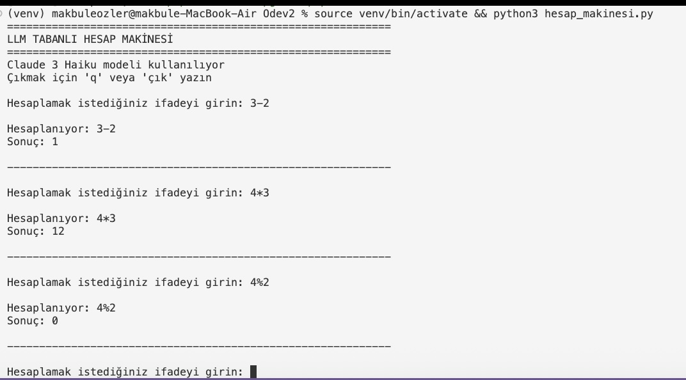

# 🧮 Hesap Makinesi 

Terminal'den kullanılan basit bir Python hesap makinesi uygulaması.

## 📋 Özellikler

- ✅ Terminal'den direkt kullanım
- ✅ Temel matematiksel işlemler (toplama, çıkarma, çarpma, bölme)
- ✅ Üs alma işlemi
- ✅ Hata yönetimi

## 🚀 Kurulum

### Gerekli paketleri yükleyin:
```bash
pip install -r requirements.txt
```

## 💻 Kullanım

### Temel Kullanım:
```bash
python3 hesap_makinesi.py "2 + 2"
```

### Diğer Örnekler:
```bash
python3 hesap_makinesi.py "5 * 8"
python3 hesap_makinesi.py "100 / 4"
python3 hesap_makinesi.py "2 ** 10"
```



## 🎓 Ders Bilgileri

**Ders:** MATH690 - Graduate Seminar  
**Dönem:** Fall 2025, Hafta 3  

## 📝 GitHub'a Pushlama
```bash
git add README.md
git commit -m "docs: Add README for calculator app"
git push origin main
```