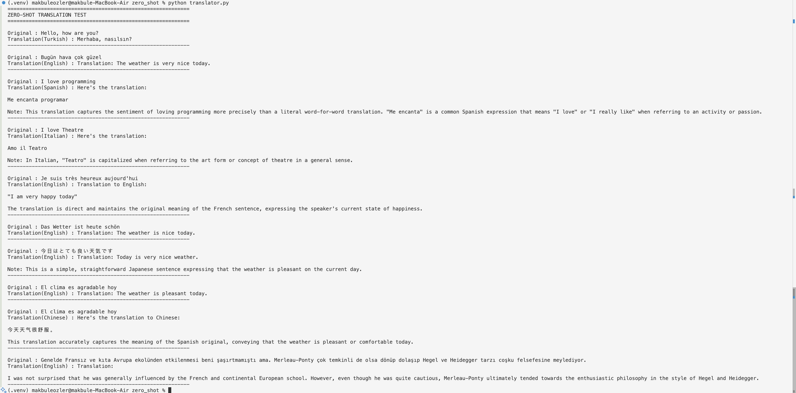
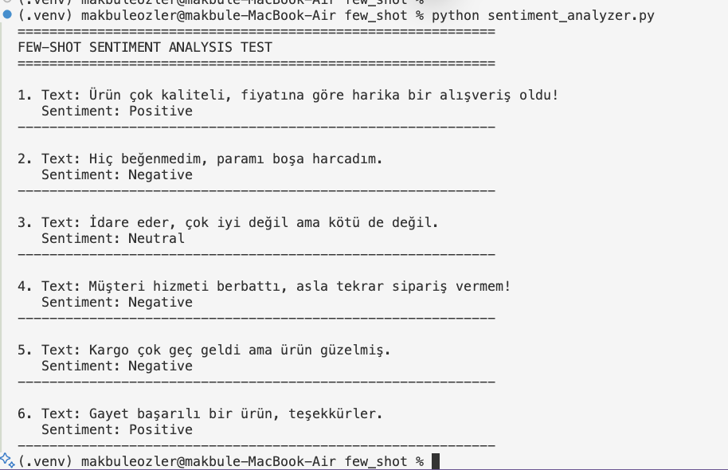
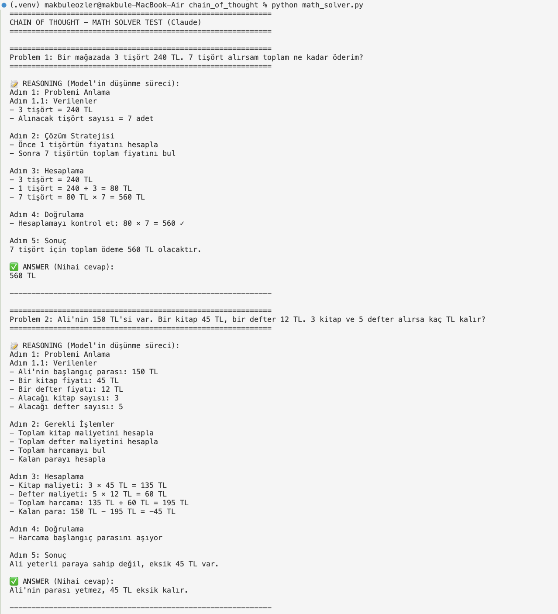
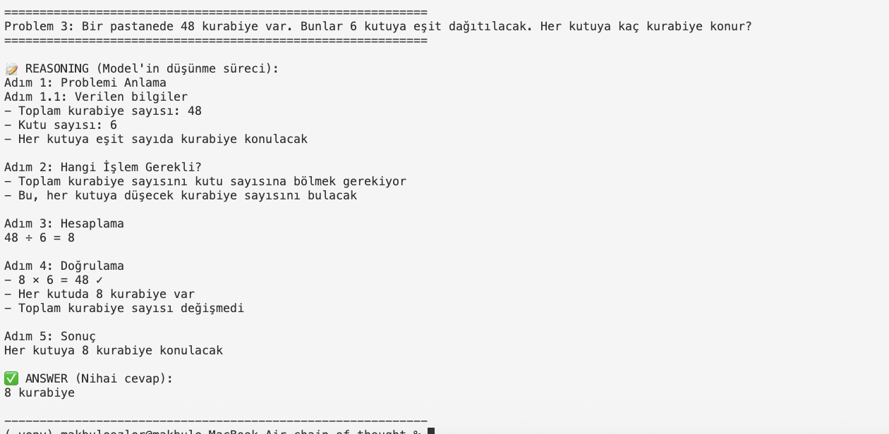
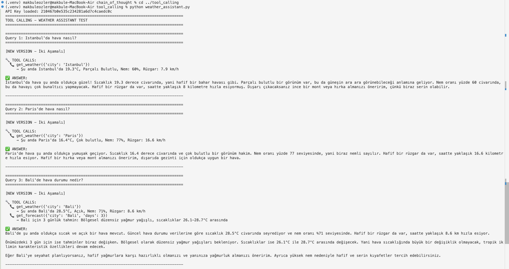
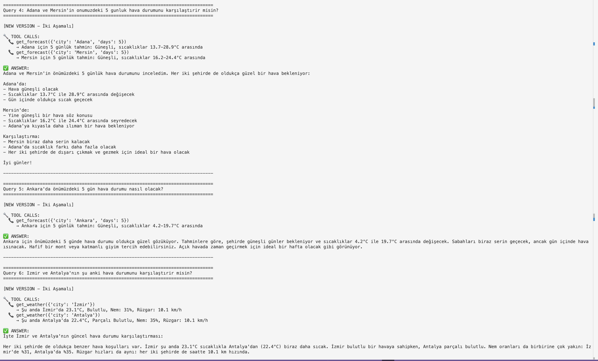
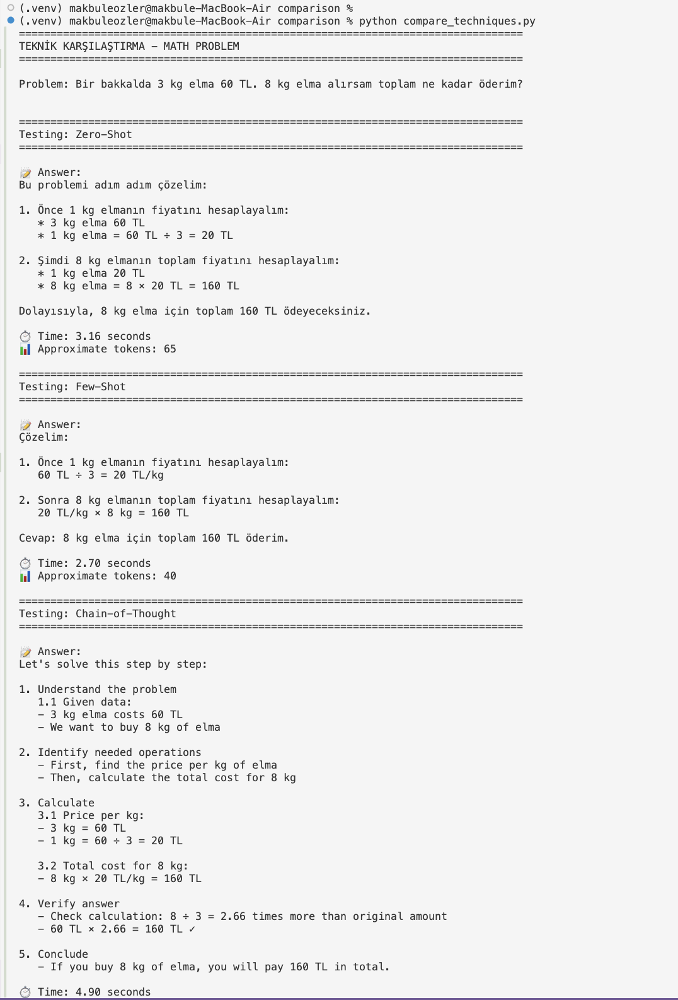
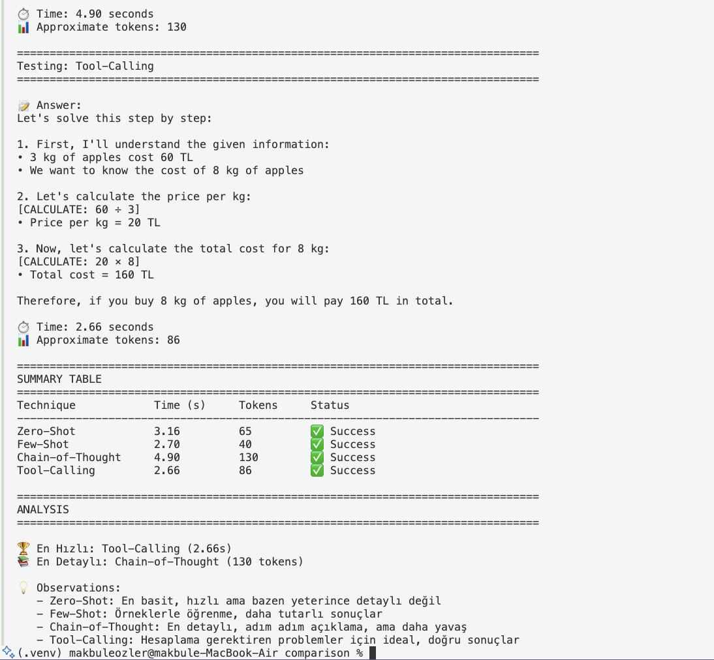

-----------------------

# GSÜ LLM Ödev 1 - Prompting Teknikleri Raporu


**Tarih:** 11 Ekim 2025

---

## ÖZET

Bu ödevde 4 farklı prompting tekniğini (Zero-Shot, Few-Shot, Chain-of-Thought, Tool Calling) pratikte deneyerek LLM'lerin nasıl yönlendirilebileceğini gözlemledim. Aynı görevi farklı tekniklerle çalıştırdığımda hız, detay ve doğruluk açısından belirgin farklar gördüm. CoT en detaylı ve güvenilir açıklamaları üretirken; Few-Shot genelde en hızlı/ucuz dengeyi sundu. Gerçek dünyaya yakın senaryolarda **Tool Calling** net şekilde öne çıktı.

---


## ÇALIŞTIRMA

```bash
# env
cd Fall2025/MATH690_Graduate_Seminar/W03/Ozge
python -m venv .venv && source .venv/bin/activate
pip install -r requirements.txt  # (litellm, python-dotenv vs.)

# Zero-Shot
cd zero_shot && python translator.py

# Few-Shot
cd ../few_shot && python sentiment_analyzer.py

# Chain-of-Thought
cd ../chain_of_thought && python math_solver.py

# Tool Calling
cd ../tool_calling && python weather_assistant.py

# Comparison
cd ../comparison && python compare_techniques.py

---

## KULLANDIĞIM MODELLER

> Anahtarlar **lokalde .env** içinde; rapora hiçbir secret eklenmedi.

- **Anthropic**
  - `claude-3-5-haiku-20241022` (birincil; hızlı/ekonomik)
  - `claude-3-5-sonnet-20241022` (fallback; daha güçlü)
- **Google Gemini**
  - `gemini/gemini-2.0-flash-exp` (free-tier; günlük kotada 429 hatası)
- **OpenAI**
  - `gpt-4o-mini` (ek fallback; sınırlı test)

**Neden bu seçim?**  
Few-Shot/Zero-Shot için küçük ama stabil modeller yeterli. CoT/Reasoning ve Tool-Calling’de daha güçlü/kararlı modeller (sonnet) avantaj sağlıyor. Sağlayıcı yoğunluğu/429 gibi durumlara karşı **model fallback** ve **exponential backoff** ekledim.

---

## 1. ZERO-SHOT TEKNİĞİ

### Tanım
Modele örnek vermeden, sadece talimatla görev yaptırma.

### Kullandığım Örnek
**Program:** Çeviri Uygulaması (`zero_shot/translator.py`)  
**Görev:** Metinleri farklı dillere çevir.

### Test Sonuçları (örnekler)
- “Hello, how are you?” → **TR**: *Merhaba, nasılsın?*
- “Das Wetter ist heute schön” → **EN**: *The weather is nice today.*
- “今日はとても良い天気です” → **EN**: *Today is very nice weather.*

> Not: Gemini free-tier kotası dolunca 429 aldı; otomatik olarak Anthropic/OpenAI fallback’e geçtim.

### Gözlemler
✅ Çok hızlı, basit işlerde yeterli.  
❌ Karmaşık biçim/ton isteklerinde tutarsız kalabiliyor; “neden böyle yaptı?” takibi zor.

### Kod Çıktı Görseli
 

### En Zorlandığım Kısımlar
- Prompt’u kısa tutarken hedef dil/biçimi netleştirmek.
- Dil çiftine göre (TR→FR gibi) aksan/özel karakterlerin korunması.

---

## 2. FEW-SHOT TEKNİĞİ

### Tanım
Birkaç input-output örneğiyle model davranışını örnek üzerinden öğretme.

### Kullandığım Örnek
**Program:** Duygu Analizi (`few_shot/sentiment_analyzer.py`)  
**Görev:** Türkçe yorumları Pozitif/Negatif/Nötr etiketlemek.

### Test Sonuçları (örnekler)
- “Ürün çok kaliteli…” → **Positive**  
- “Hiç beğenmedim…” → **Negative**  
- “İdare eder…” → **Neutral**  
- “Kargo geç geldi ama ürün güzelmiş.” → **Negative** *(örnek bias’ından etkilendi)*

### Gözlemler
✅ Format/ton isteğinde çok tutarlı; Zero-Shot’tan daha güvenilir.  
❌ Prompt uzuyor → token maliyeti artıyor. Örnek seçimi **kritik** (yanlı örnek = yanlı model).

### Kod Çıktı Görseli


### En Zorlandığım Kısımlar
- Örnek kürasyonu (bias).  
- 3–5 örnek arasında denge (fazla örnek = pahalı / az örnek = yetersiz öğrenme).

---

## 3. CHAIN-OF-THOUGHT (CoT)

### Tanım
“Adım adım düşün” talimatıyla akıl yürütme sürecini görünür kılmak.

### Kullandığım Örnek
**Program:** Matematik Problemi Çözücü (`chain_of_thought/math_solver.py`)  
**Görev:** Kelime problemlerini adım adım çözmek.

### Test Sonuçları (özet)
- **Problem 1:** 3 tişört 240 TL → 7 tişört = **560 TL** (birim fiyat 80 TL hesaplandı)  
- **Problem 2:** 150 TL bütçe; 3×45 + 5×12 = 195 TL → **para yetmiyor, -45 TL**  
- **Problem 3:** 48 kurabiye / 6 kutu → **8** kurabiye/ kutu

### Gözlemler
✅ En doğru ve denetlenebilir çıktılar; nerede hata yaptığını görmek kolay.  
❌ En yavaş ve en pahalı (detay açıklamalar token/latency artırıyor).  
🔎 İlginç: Bütçe probleminde eksi bakiyeyi doğru yakaladı (Zero-Shot çoğu zaman kaçırıyor).

### Kod Çıktı Görselleri
  


### En Zorlandığım Kısımlar
- Bazı durumlarda gereğinden uzun açıklamalar → maliyet.  
- Bazen gereksiz varsayım (metinsel problemlerde hallucination’a dikkat).

---

## 4. TOOL CALLING

### Tanım
LLM’in dış fonksiyon/servisleri çağırarak gerçek veriye erişmesi.

### Kullandığım Örnek
**Fonksiyon:** `weather_assistant2()` (iki aşamalı versiyon)
**Araçlar:** `get_weather(city)`, `get_forecast(city, days)`

### Test Sonuçları (özet)
- **İstanbul/Paris anlık hava** → sıcaklık/nem/rüzgâr bilgisiyle doğal dil çıktısı.  
- **Bali** → anlık + 3 günlük tahmin çağrıları arka arkaya.  
- **Adana vs Mersin 5 günlük** → iki ayrı `get_forecast` çağrısı ile net karşılaştırma.  
- **İzmir vs Antalya anlık** → tek satırda kıyas.

### Gözlemler
✅ Gerçek veriyle cevap → güvenilirlik artıyor.  
✅ Model hangi tool’u ne zaman çağıracağına akıllıca karar veriyor.  
❌ JSON şeması/failure case’leri özen istiyor; güvenlik için **write action** yok.

### Kod Çıktı Görselleri
  


---

## 5. KARŞILAŞTIRMA

### Test Problemi
“Bir bakkalda 3 kg elma 60 TL. 8 kg elma alırsam toplam ne kadar öderim?”

### Sonuç Tablosu (tek koşu ölçümleri)

________________________________________________________
|             SUMMARY TABLE                             |
________________________________________________________
|Technique             | Time (s)| Words |  Status    |
|Zero-Shot             | 3.16    |    65  | ✅ Success |
|Few-Shot              |2.70     |    40  | ✅ Success |
|Chain-of-Thought      |4.90     |   130  | ✅ Success |
|Tool-Calling          | 2.66    |    86  | ✅ Success |
________________________________________________________


**Analiz**  
🏆 **En Hızlı:** Tool-Calling (2.66 s) — minimal reasoning + net hesap  
📚 **En Detaylı:** Chain-of-Thought (130 tokens) — tüm adımlar görünür

**Örnek Çıktılar (kısaltılmış)**

- **Zero-Shot:**  
  “Unit price = 60/3 = 20 TL/kg → 8×20 = **160 TL**.”
- **Few-Shot:**  
  “60 ÷ 3 = 20; 20 × 8 = **160 TL**.” *(format kısa, örnekleri taklit etti)*  
- **CoT:**  
  “1) Problemi anla… 2) İşlemler… 3) Hesap: 60/3=20, 20×8=**160**… 4) Doğrulama… 5) Sonuç.”  
- **Tool-Calling (simüle):**  
  “[CALCULATE: 60/3] → 20; [CALCULATE: 20*8] → **160** TL”

**Çıkarımlarım**
1. **Basit görev → Few-Shot** genelde en iyi denge (hız/ucuz + yeterli doğruluk)  
2. **Orta zorluk → Zero-Shot** çoğu durumda yeter  
3. **Kritik/karmaşık → CoT** (denetlenebilirlik ve doğruluk için)  
4. **Gerçek veri/hesap → Tool-Calling** (API/araçlarla entegrasyon)

**Kod**: `comparison/compare_techniques.py`  
**Görseller**:  
  


---

## DOĞRULAMA (Output Verification)

- **Deterministik kontrol:** Matematikte beklenen sonuçları Python ile doğruladım (160 TL vb.).  
- **Model-üstü denetim:** Şüpheli cevapları ikinci bir modelle “audit” ettim.  
- **Tool sonuç eşleştirme:** Tool-Calling çıktılarıyla model metninin tutarlı olmasını kontrol ettim.  
- Her testte `✅ PASS / ❌ FAIL` etiketi ve kısa gerekçe ekledim.

---

## ÖĞRENDİKLERİM

- **Temperature önemli:**  
  - `0.1–0.3` → mantık/matematik için tutarlı  
  - `0.7+` → yaratıcı yazım/çeşitlilik  
- **Rate limit & overloaded:**  
  - 429/`RESOURCE_EXHAUSTED` (özellikle Gemini free tier) → **exponential backoff + fallback**  
  - Anthropic `overloaded_error` → kısa bekleme + alternatif modele geçiş  
- **Maliyet bilinci:** CoT en pahalı; Few-Shot genelde en ekonomik denge.  
- **Güvenlik:** `.env` kesinlikle repoya girmiyor; `.gitignore` ile koruma.

---

## KAYNAK VE ATIFLAR

- **Chip Huyen – Agents yazıları:**  
  “Agent = Environment + Tools”, “Planning/Task Decomposition”, “ReAct Pattern” — Tool-Calling ve CoT bölümlerinde uygulandı.  
- **Ders (Erdem Hoca) vurguları:**  
  Hız-doğruluk-maliyet trade-off’ları, JSON/araç güvenliği, üretim ortamında fallback ve hataya dayanıklılık.

---

## SONRAKİ ADIMLAR (Proje)

- **Reflexion / Self-Consistency (k>3):** CoT’ta çoklu örnekleme + çoğunluk oylaması  
- **Gerçek API’ler:** Open-Meteo/Amadeus/Booking vb. ile entegre denemeler  
- **Otomatik raporlama:** Test → metrik → grafik → `assets/` üretimi

---

Sonuç
Bu ödev bana Prompt Engineering'in bir sanat olduğunu gösterdi. Aynı model, aynı görev ama farklı promptlar → tamamen farklı sonuçlar.
En büyük insight: Karmaşık problemler için CoT kullan, basit işler için Few-Shot yeterli, ama gerçek dünya entegrasyonu için Tool Calling şart!
Proje için plan: Seyahat planlayıcıda:

Tool Calling: Uçuş/otel API'leri
CoT: Bütçe optimizasyonu
Few-Shot: Kullanıcı tercihlerini anlama
